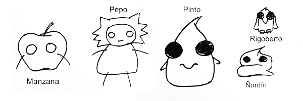
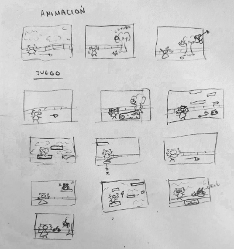

## EL MUNDO DE PEPO

Proyecto de Creación Multimedia Interactiva de la  Facultad de Bellas Artes de la Univesidad de Granada

# 1 Datos 

**Titulo** : El Mundo de Pepo

**Web:**   [(url github.io)](https://miriammoraless.github.io/ElMundoDePepo/)

**Autor:**  Míriam Morales Sánchez

 [Profile Card](cmi-card.html)  [Alternate Profile Card](cmi-card2.html)

**Resumen** : Este proyecto es una historia simple, donde se busca rescatar a una pequeña manzana. El protagonista Pepo, tras encontrar a Manzana Papá en un estado de descomposición, tiene como objetivo salvar al hijo de su amiga de las manos del malvado Pinto, un temible villano que come manzanas.

**Estilo/género:** Juego de aventura.

**Logotipo** :

**Resolución:** 1152x648px tamaño fijo.

**Probado en:**   Pc, Google Chrome.

**Tamaño proyecto:** 23MB 

**Licencia** Este proyecto tiene una Licencia CC Reconocimiento Compartir igual (CC BY-SA)

**Fecha** : 28/05/2026

**Medios** :

- Github:Miriammoraless

# 2. Memoria del proyecto 

### 2.1 Storyboard: 

Primero desarrollé los personajes, con un diseño simple, al igual que el resto del proyecto.

Luego planteé que el desrrollo del juego se diera de forma líenal, estando Pepo en la esquina izquierda todo el tiempo.

En primer lugar, al iniciar el juego, aparece la animación principal, donde Pinto está cometiendo el secuestro del niño, tras haber devorado al padre. Tras esto, al iniciar la partida, el jugador se encontrará con la madre, quién le dará la misión de rescatar a su hijo. Tras pasar el árbol en el que se situaba la madre, encontrá al padre, quién yace en un estado de descomposición en el suelo.

Posteriormente, aparcecerán unas plataformas, las cuáles, impedirán el paso. Para seguir avanzando hay que saltar por ellas, con cuidado de que los enemigos no toquen al jugador, ya que, de lo contrario, se reiniciará la partida. En todo momento la cámara del jugador se mantedrá con Pepo en una esquina, dicicultando así el juego. 

Tras pasar esta situación, habrá otra plataforma donde estará Rigoberto. Este no se moverá, ni atacrá directamente al jugador pero emitirá algunos sonidos raros. Por último, al final del mapa, aparecerán más plataformas, la cuales llevarán directamente hasta Pinto y el niño. Para salvar a la manzana, Pinto propondrá unas adivinanzas. Esto llevará a dos finales, uno que tras fracasar las adivinazas, se comerá ñas manzanas, y otro, donde devolverá al niño. 

### 2.2. Esquema de navegación 

# 3. Metodología

Metodología de desarrollo de productos multimedia basado en una metodología de UX (User Experience)

## Etapa 1: Ideación de proyecto

**Investigación de campo** (propuestas inspiradoras para el proyecto)

- Animal Crossing: la idea de un árbol con tres manzanas
- Super Mario bross: La ide a de recatar de un enemigo final a alguien
  

**Motivación de la propuesta** 

Este  proyecto es interesante porque:
- Tiene una estética cutre, la cuál, para mi lo hace ver divertido
- Es una histora simple pero, contiene pequeñas cosas, como una aventura entre la Manzana Mamá y el protagonista Pepo

**Publico / audiencia**

- Orientado a gente joven, ya que aunque tiene una estética infantil, no es muy recomendado para niños pequeños.

## Etapa 2: Desarrollo / actividades realizadas

El desrrollo del juego se fué formando muy poco a poco. En un principio desarrollé una idea general y 
(qué soluciones has planteado y cómo se han resuelto: juego, galería de fotos, grabación de video, etc.)

- Introducción y menú: Fue lo primero que desarrollé del proyecto, aunque la introducción era más simple en un principio. LA primera animación que realicé fue el personaje andando hacia la derecha, ya que no sabía como realizar lo que tenía en mente. Tras aprender como funcionaba mejor la animación de godot, hice la introducción actual del proyecto. Luego realicé la pantalla del menú, utilizando los elementos principales del juego. Además para darle más interés, hice que se pueda interactuar un poco con el personaje que aparece en pantalla, al pasar el ratón por encima del ojo lo cierra. También integré un fondo en movimeinto para que tenga dinamismo.
- Juego: El juego consiste en rescatar a la manzana y para tener obstaculos hacia esta, decidí implementar un parkour junto con enemigos. Para hacer esto al personaje principal le integré gravedad para poder ir saltando por las plataformas. Los enemigos, son también bastante simples, los incluí en una plataforma y cuando detectan que la plataforma acaba se giran hacia la otra dirección.
- video: Para la integración de video no tenía mucha idea, por lo que decidí hacer a Pepo en el mundo real. Hice un dibujo a papel y, en el escenario más parecido que tengo en mi casa al juego, hice que Pepo fuera atacado por mi gato. El vídeo lo decidí incluir en la pantalla de personajes de Pepo, ya que no tiene nada que ver con la historia principal y es algo que solo le sucede a Pepo
- Personajes: para la galería del juego hice una muestra de los personajes que estrían integrados en el juego. A cada uno le puse una peueña descripción con alguna característica. Para diferenciar lo personajes buenos de los malos, a parte de leer la descripción, hice que los buenos tuvieran los ojos blancos por dentro y los malos con los ojos completamente negros, con la pupila completamente dilatada. 
- Instrucciones y ayuda al usuario: las instrucciones del juego decidí implementarlas en la pantalla de cuando juegas, ya que implenmentandolas en las pantalla de ajustes, mucha gente no lo miraría, ya que yo cuando juego a algo no suelo mirar la configuración. Por lo tanto puse un poco de texto al principio a modo de tutorial.
- Dialogos: los dialos han sido poco usados ya que no es un juego dedicado al dialogo. Lo he implementado para que de la misión principasl al jugador y para el enemigo final.
- Música y sonido:

## Etapa 3: Problemas identificados

(que consideras que no  funciona correctamente y por qué )

# 4. Conclusiones 

(explica brevemente tu valoración, problemas que has detectado y que te gustaría hacer o mejorar en el futuro )

# 5 Referencias 

**Recursos y materiales audiovisuales:**

* Musica: Desarrollada con ayuda de compañeras, exceto el sonido de los botones (https://pixabay.com/es/sound-effects/search/button-click/) 
* Imágenes: Dibujos míos 
* Tipografía: (Google Fonts)

**Herramientas utilizadas**

- Godot Engine 4.x
- Illustrator
- Affinity
- Photoshop

(imagen de la licencia, copiar y pegar aquí la correcta)
https://creativecommons.org/licenses/?lang=es

* logos en https://creativecommons.org/mission/downloads/
  
  </small>

Mayo 202X
